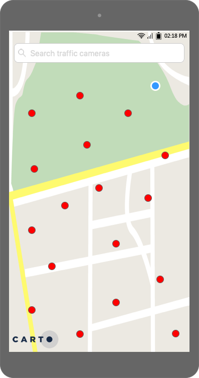

# CARTO Android Test

We want you to build an Android app showing traffic cameras according to a specific dataset. The app should show the traffic cameras on a map according to their latitude and longitude.

Also, you need to handle your GPS location. The traffic cameras are in Sydney so, unless you're really in Sydney, you'll have to use a mock GPS location that's somewhere near them. 

Hereafter, we will refer to the traffic cameras as Points of Interest (POIs).

Before starting the test, please visit our [open positions](https://carto.com/careers/#open-positions) and fill in the form. If there are no open positions but you still would like to apply, please send an email to [mdominguez@carto.com](mailto:mdominguez@carto.com), she'll get back to you asap.

We'd like you to send us your app in the next 15 days. If you have any question about the test, please don't hesitate to [contact us (jguerrero@carto.com)](mailto:jguerrero@carto.com).

## Mockups

### Home & POI search

- <b>Home Screen</b>: Show the traffic cameras and the blue dot with your GPS location (if it's enabled).
- <b>POI Search Screen</b>: Filter the traffic cameras by *title* or *description*. Also, show a different icon depending on *direction* value, at least for 3 different values. For the rest, you can use a default icon.

### POI Detail & POI PreRoute & POI Route (without GPS Location)

This is how the app should behave when you choose a traffic camera (by clicking on a marker on the map or by using the search bar) and your GPS location is <b>disabled</b>:

- <b>POI Detail Screen</b>: Show the traffic camera details. If you click on "DIRECTIONS", the next screen will be the POI PreRoute screen, described below.
- <b>POI PreRoute Screen</b>: Choose another traffic camera by clicking on a marker or by using the search bar (clicking on the "Choose starting traffic camera" field). Since it's not necessary to type on this field or change the destination, you can use a *TextView* instead of an *EditText*.
- <b>POI Route Screen</b>: Draw the route between the selected traffic cameras, including the distance and time of the route. If you choose another traffic camera, it will be set as the <b>origin</b> of the route. The "START" button should be disabled.

### POI Detail & POI Route & POI Navigation (with GPS Location)

This is how the app should behave when you choose a traffic camera (by clicking on a marker on the map or by using the search bar) and your GPS location is <b>enabled</b>.

- <b>POI Route Screen</b>: Draw the route between your location and the selected traffic camera, including the distance and time of the route. It's not necessary to be able to change the destination of the route. If you click the "START" button, the next screen will be POI Navigation Screen, described below.
- <b>POI Navigation</b>: Show a panel with the text "YOU ARE NAVIGATING" and another one with the button "FINISH". If you click on this button, you should return to the previous screen.

## Considerations
- You are free to choose the specific map library to work with.
- You are free to modify the UI and the flow between screens.
- Although we work with Kotlin, you are free to use Java for this test.
- The dataset is accessible through a GET over `https://javieraragon.carto.com/api/v2/sql?q=SELECT id, direction, href as image, region, title, view as description, ST_X(the_geom) as longitude, ST_Y(the_geom) as latitude FROM ios_test`. The query param `q` is used to pass a SQL query to extract the data from the dataset. Under the hood, it will query a Postgres + PostGIS which enables multiple ways to get info using SQL and special spatial functions.
- The dataset includes images of the traffic cameras.
- The app should work on all screen sizes, but you don't need to add more than one layout for every screen.
- Use only portrait mode.
- If for whatever reason you are not able to complete the test, don't worry, we'll review it anyway.

## We will pay special attention to...
- Clean Code and scalable architecture. 
- Creativity of the solution.
- Performance!
- Any extra details in terms of functionality, UI/UX or performance. Think of this task as an opportunity to showcase all of your technical skills.
- Documentation (use the README for this), explaining your solution and your technical decisions. If you decide to leave out certain things, tell us why.

## You will get bonus points if...
The following features are not mandatory, but will definitely give you bonus points! 
- The app also works <b>offline</b>.
- You use our [mobile sdk](https://carto.com/developers/mobile-sdk/). If you end up working at CARTO, you will work with it a lot.
- The app is written as production code.
- You include unit and functional tests.
- Animations. For example, you could use *BottomSheetDialogFragment* to show information on the map.
- The app works in landscape mode but without changing the design (we know it's a lot of work).
- <b>IMPORTANT</b>: You can substitute any of the points mentioned in the bonus section with your personal code repositories. For example, if you already have a repository where you demonstrate how to work with an offline app, simply include the URL and let us know where to find the relevant bits.

## Ok, you've built the app, what should you do now?
Invite [@jaimegc](https://github.com/jaimegc) to the repo of your app. Please add a link to the APK in the README to help us with the installation.
